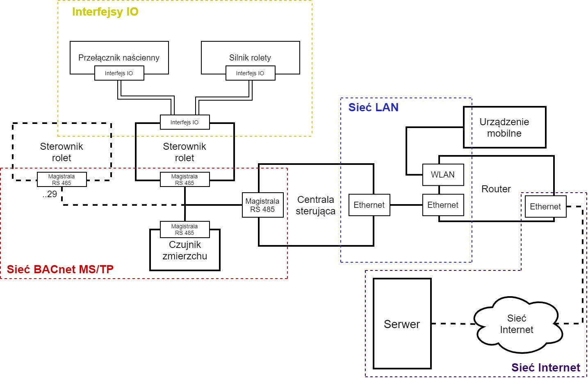
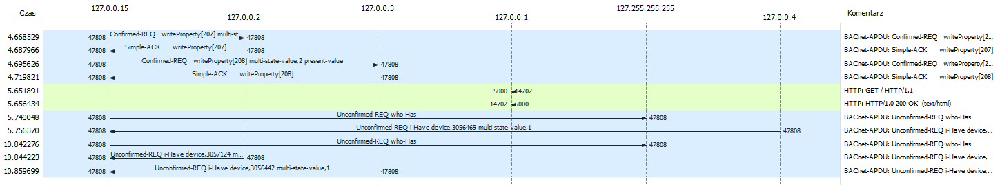
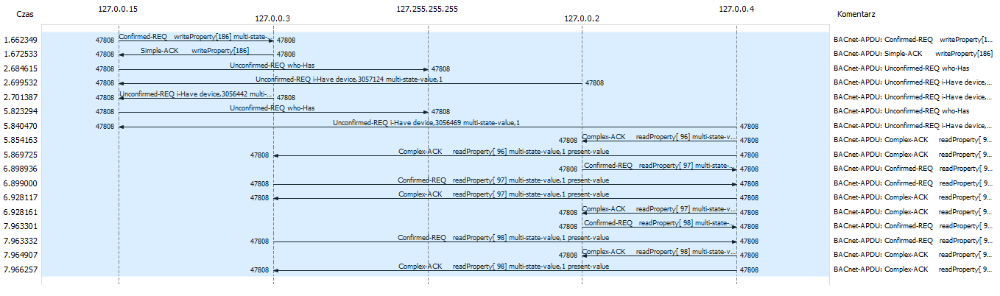
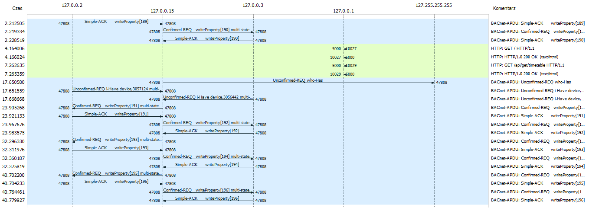

# Simulation for IoT system based on BACnet protocol
It is a part of project: *"Projekt sterownika rolet, przy wykorzystaniu interfejsu BACnet"* in the classes *"Internet Rzeczy"* (eng: *"Project of Rollershutter driver, with BACnet interface"*, *"Internet Of Things"*).

This part is intended for look how BACnet/IP messages looks like, and check if the flow matches assumptions.

**Dependencies**
- PyQt5
- BAC0
- flask

---

## Base networks
Simulation main point was check if assumed dataflow is correct. Presented (picrel) network shows final system.

---

## Dataflow diagrams 

### Manual Mode
In this mode networks only sync msgs. The driver waits for a command from the user (GUI in that case).

### Auto Basic Mode
Auto Basic mode is working based only on Dusk Sensor state.

### Auto Extended Mode
Auto Extended mode is working based only on timetable from server with list of time dependent actions. (look at Serwer/timetable.json)

---

NOTE: It is simple University Project (that part is extended) created to receive highest grade - 5.5. Project will be abandoned as soon as we receive the grade.
